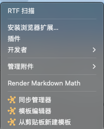
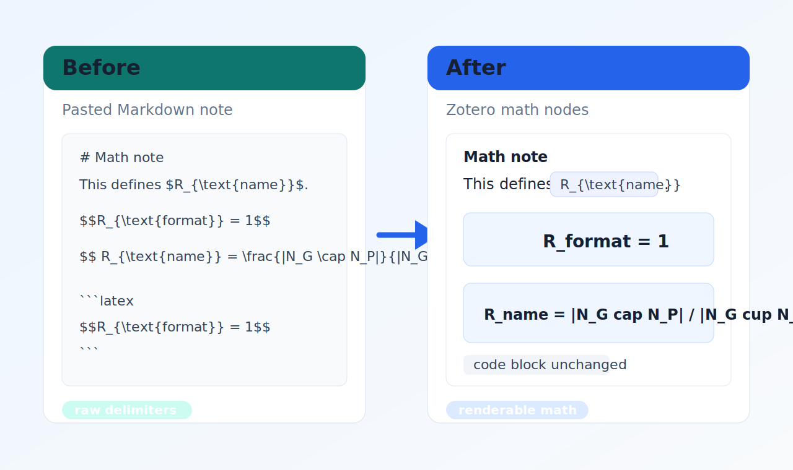

# Zotero Markdown Math Patch

一个用于 Zotero 7 笔记的轻量插件，提供手动菜单命令 **Render Markdown Math**，用于修复 Zotero / Better Notes 中粘贴 Markdown 公式后不能自动渲染的问题。

典型场景是：你把 `$$...$$` 或 `$...$` 形式的 Markdown 公式粘贴进 Zotero 笔记后，Zotero / Better Notes 仍然把它当普通文本显示。本插件会把这些 Markdown 公式分隔符转换成 Zotero 笔记编辑器能够识别和渲染的数学公式节点。

当前版本只做手动转换：**不会监听粘贴事件，也不会在后台自动改写笔记**。每次粘贴新公式后，需要手动执行一次 `Render Markdown Math`。

## 截图

Zotero 主窗口菜单入口：



转换前后示意：



## 功能

- 在 Zotero 主窗口 `工具` 菜单中添加 `Render Markdown Math`。
- 在单独打开的 Zotero 笔记窗口 `编辑` 菜单中添加同名命令。
- 处理当前打开的笔记、当前笔记标签页，或 Zotero 文献库中选中的单个笔记条目。
- 将行内 Markdown 公式转换为 Zotero 行内公式节点。
- 将块级 Markdown 公式转换为 Zotero 块级公式节点。
- 支持同一篇笔记中多个公式分别转换。
- 跳过已有 Zotero 公式节点、代码块、预格式化块、脚本和样式内容。
- 尽量保持普通笔记结构不变，包括中文文本、标题、列表、引用和普通段落。

## 兼容性

项目目标环境是 Zotero 7+，并优先兼容 Zotero / Better Notes 9.0.4 的笔记工作流。

插件不依赖 Better Notes 私有 API。它读取并保存 Zotero note HTML，把公式写成 Zotero 能识别的结构：

```html
<span class="math">$inline$</span>
<pre class="math">$$block$$</pre>
```

## 支持的输入

同一行块级公式：

```markdown
$$R_{\text{format}} = 1$$
```

同一行块级公式，分隔符内部允许空格：

```markdown
$$ R_{\text{name}} = \frac{|N_G \cap N_P|}{|N_G \cup N_P|} $$
```

多行块级公式：

```markdown
$$
R_{\text{format}} = 1
$$
```

行内公式：

```markdown
这是 $R_{\text{name}}$ 的定义
```

同一篇笔记中可以包含多个公式，插件会分别转换。语义化代码块会被跳过：

````markdown
```latex
$$R_{\text{format}} = 1$$
```
````

## 安装

从源码构建 XPI：

```sh
npm install
npm test
npm run build
```

构建产物路径：

```text
builds/zotero-math-patch.xpi
```

在 Zotero 中安装：

1. 打开 Zotero。
2. 进入 `工具` -> `插件`。
3. 点击插件页面右上角的齿轮图标。
4. 选择 `Install Add-on From File...`。
5. 选择 `builds/zotero-math-patch.xpi`。
6. 如果 Zotero 提示重启，请重启 Zotero。

如果你要安装新的本地构建版本，直接用新的 XPI 覆盖安装即可；如 Zotero 插件页面提示需要重启，则重启 Zotero。

## 使用方法

1. 把包含 Markdown 公式的内容粘贴进 Zotero note 或 Better Notes note。
2. 保持该笔记处于打开状态，或在 Zotero 文献库中选中该笔记条目。
3. 在 Zotero 主窗口点击 `工具` -> `Render Markdown Math`。
4. 如果笔记是单独窗口打开的，点击 `编辑` -> `Render Markdown Math`。
5. 插件会弹出结果提示，显示本次转换了多少个块级公式和行内公式。

这个命令是手动触发的。后续如果又粘贴了新公式，需要再次执行 `Render Markdown Math`。

## 快速验证

可以新建一个测试笔记，粘贴下面内容后执行 `Render Markdown Math`：

````markdown
这是 $R_{\text{name}}$ 的定义。

$$R_{\text{format}} = 1$$

$$ R_{\text{name}} = \frac{|N_G \cap N_P|}{|N_G \cup N_P|} $$

$$
R_{\text{multi}} = 2
$$

```latex
$$R_{\text{code}} = 3$$
```
````

预期结果：

- 行内公式、两种同一行块级公式、多行块级公式都会转换成可渲染公式。
- 如果最后一段已经被 Zotero 保存为真正的代码块，则其中的 `$$...$$` 不会被转换。

## 故障排查

- 菜单中没有 `Render Markdown Math`：确认插件已启用，并在 Zotero 插件页面按提示重启 Zotero。
- 安装 XPI 时提示不兼容：重新运行 `npm run build`，确认安装的是 `builds/zotero-math-patch.xpi`，并确认 Zotero 版本为 7 或更新版本。
- 提示 `No current Zotero note found.`：先打开一个笔记标签页，或在 Zotero 文献库中选中一个笔记条目。
- 提示 `No Markdown math delimiters found.`：当前笔记中没有插件支持的 `$...$` 或 `$$...$$` 公式，或这些内容已经转换过。
- 转换后没有立即刷新：关闭并重新打开该笔记；如果仍未显示，检查 Zotero 插件页面和错误控制台。

## 开发

安装依赖并运行转换器测试：

```sh
npm install
npm test
```

构建 Zotero 插件包：

```sh
npm run build
```

检查生成的 XPI：

```sh
unzip -t builds/zotero-math-patch.xpi
```

## 项目结构

```text
manifest.json                 Zotero 插件 manifest
bootstrap.js                  Zotero bootstrap 入口
chrome/content/math-renderer.js
                              菜单注册、当前笔记查找、保存和刷新
chrome/content/converter.js   Markdown 公式到 Zotero math HTML 的转换逻辑
test/converter.test.js        Node 环境下的转换器测试
docs/assets/                  README 截图和示意图
```

## 已知限制

- 粘贴后不会自动转换，必须手动执行 `Render Markdown Math`。
- 只处理当前笔记，不会批量处理整个文献库或分类。
- 这不是完整 Markdown 解析器。插件会跳过 `<pre>` 和 `<code>` 等语义化代码块，但如果 Zotero 没有把三反引号内容转换成真正的代码块，原始三反引号文本仍可能被当作普通文本处理。
- 行内公式不能包含换行。为了减少误转换，`$ x $` 这种分隔符内部带首尾空格的行内公式会被忽略。
- 独立块级公式会自动去掉 `$$` 内侧首尾空格。
- 不支持嵌套或不成对的美元符号分隔符。
- 插件只创建 Zotero math 节点，本身不实现 KaTeX 或 MathJax 渲染器。
